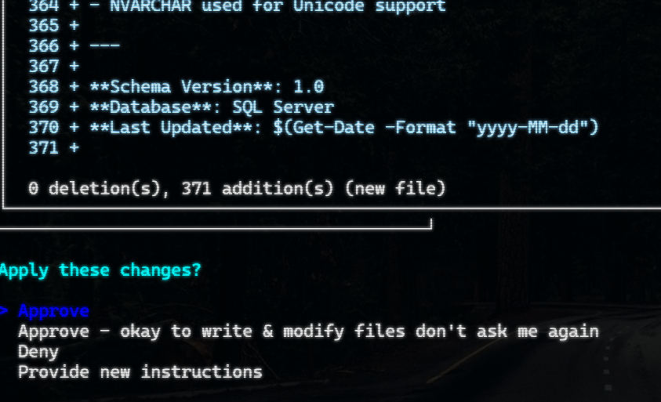
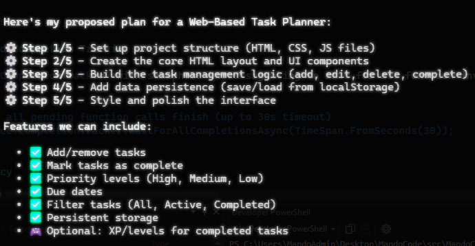
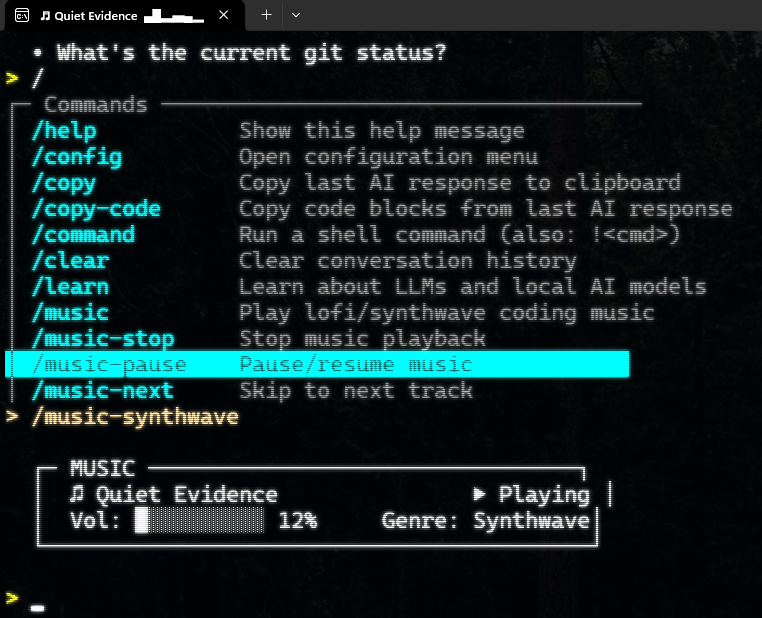

<p align="center">
  
</p>

<h1 align="center">MandoCode</h1>

<p align="center">
  <strong>Your AI coding assistant — run locally or in the cloud with Ollama.</strong><br>
  No API keys required. Just you and your code.
</p>

<p align="center">
  <a href="https://www.nuget.org/packages/MandoCode"></a>
  
  
  
  
  
</p>

<p align="center">
  
</p>

MandoCode is an AI coding assistant powered by [Semantic Kernel](https://github.com/microsoft/semantic-kernel) and [Ollama](https://ollama.ai). Run locally or connect to Ollama cloud — no API keys required. It gives you Claude-Code-style project awareness — reading, writing, searching, and planning across your entire codebase — without ever leaving your terminal.

It understands **any file type**: C#, JavaScript, TypeScript, Python, CSS, HTML, JSON, config files, and more.

---

## Install

```bash
# Prerequisites: .NET 8.0 SDK + Ollama installed and running

dotnet tool install -g MandoCode
mandocode
```

### Or build from source

```bash
git clone https://github.com/DevMando/MandoCode.git
cd MandoCode
dotnet build src/MandoCode/MandoCode.csproj
dotnet run --project src/MandoCode/MandoCode.csproj -- /path/to/your/project
```

On first run, MandoCode uses `minimax-m2.5:cloud` by default. Run `/config` inside the app or configure from the command line:

```bash
mandocode config set model qwen2.5-coder:14b
mandocode config set endpoint http://localhost:11434
```

---

## What Makes MandoCode Different

<table>
<tr>
<td width="50%">

### Safe File Editing with Diff Approvals

Every file write and delete is intercepted with a color-coded diff. You approve, deny, or redirect — nothing touches disk without your say-so.



</td>
<td width="50%">

### `@` File References

Type `@` to autocomplete any project file and attach it as context. The AI sees the full file content alongside your prompt. Reference multiple files in a single message.


</td>
</tr>
<tr>
<td width="50%">

### Task Planner

Complex requests are automatically broken into step-by-step plans. Review the plan, then watch each step execute with progress tracking.



</td>
<td width="50%">

### Built-in Music Player

Lofi and synthwave tracks bundled right in. A waveform visualizer runs in the corner while you code. Because vibes matter.



</td>
</tr>
</table>

---

## Features at a Glance

| | Feature | Description |
|-|---------|-------------|
| **AI** | Project-aware assistant | Reads, writes, deletes, and searches your entire codebase |
| **AI** | Streaming responses | Real-time output with animated spinners |
| **AI** | Task planner | Auto-detects complex requests and breaks them into steps |
| **AI** | Fallback function parsing | Handles models that output tool calls as raw JSON |
| **UI** | Diff approvals | Color-coded diffs with approve / deny / redirect |
| **UI** | Markdown rendering | Rich terminal output — headers, tables, code blocks, quotes |
| **UI** | Syntax highlighting | C#, Python, JavaScript/TypeScript, Bash |
| **UI** | Clickable file links | OSC 8 hyperlinks for file paths |
| **UI** | Terminal theme detection | Auto-adapts colors for light and dark terminals |
| **UI** | Taskbar progress | Windows Terminal integration during task execution |
| **Input** | `/` command autocomplete | Slash commands with dropdown navigation |
| **Input** | `@` file references | Attach file content to any prompt |
| **Input** | `!` shell escape | Run shell commands inline (`!git status`, `!ls`) |
| **Input** | `/copy` and `/copy-code` | Copy responses or code blocks to clipboard |
| **Music** | Lofi + synthwave | Bundled tracks with volume, genre switching, waveform visualizer |
| **Config** | Configuration wizard | Guided setup with model selection and connection testing |
| **Reliability** | Retry + deduplication | Exponential backoff and duplicate call prevention |
| **Education** | `/learn` command | LLM education guide with optional AI educator chat |

---

## Commands

Type `/` to see the autocomplete dropdown, or `!` to run a shell command.

| Command | What it does |
|---------|--------------|
| `/help` | Show commands and usage examples |
| `/config` | Open configuration (wizard or view settings) |
| `/learn` | Interactive guide to LLMs and local AI |
| `/copy` | Copy last AI response to clipboard |
| `/copy-code` | Copy code blocks from last response |
| `/command <cmd>` | Run a shell command |
| `/music` | Start playing music |
| `/music-stop` | Stop playback |
| `/music-pause` | Pause / resume |
| `/music-next` | Next track |
| `/music-vol <0-100>` | Set volume |
| `/music-lofi` | Switch to lofi |
| `/music-synthwave` | Switch to synthwave |
| `/music-list` | List available tracks |
| `/clear` | Clear conversation history |
| `/exit` | Exit MandoCode |
| `!<cmd>` | Shell escape (e.g., `!git status`) |
| `!cd <path>` | Change project root directory |

---

## How It Works

```
  You type a prompt
        |
  MandoCode adds project context (@files, system prompt)
        |
  Semantic Kernel sends to Ollama (local or cloud model)
        |
  AI responds with text + function calls
        |
  File operations go through diff approval
        |
  Rich markdown rendered in your terminal
```

The AI has sandboxed access to your project through a **FileSystemPlugin** with 9 functions: list files, glob search, read, write, delete files/folders, text search, and path resolution. All operations are locked to your project root — path traversal is blocked.

---

## Recommended Models

Models with **tool/function calling** support work best with MandoCode.

**Cloud models** (no GPU required — run remotely via Ollama):

| Model | Notes |
|-------|-------|
| `minimax-m2.5:cloud` | Default — excellent tool support |
| `kimi-k2.5:cloud` | Strong general-purpose |
| `qwen3-coder:480b-cloud` | Code-focused |

**Local models** (fully offline, runs on your hardware):

| Model | VRAM | Notes |
|-------|------|-------|
| `qwen3:8b` | ~5-6 GB | Recommended — good speed/quality balance |
| `qwen2.5-coder:7b` | ~5-6 GB | Code-focused |
| `qwen2.5-coder:14b` | ~10-12 GB | Stronger coding model |
| `mistral` | ~5 GB | General purpose |
| `llama3.1` | ~5-6 GB | Meta's model |

MandoCode validates model compatibility on startup. Run `/learn` for a detailed guide on model sizes and hardware requirements.

---

<details>
<summary><h2>Configuration Reference</h2></summary>

### Config File

Located at `~/.mandocode/config.json`

```json
{
  "ollamaEndpoint": "http://localhost:11434",
  "modelName": "minimax-m2.5:cloud",
  "modelPath": null,
  "temperature": 0.7,
  "maxTokens": 4096,
  "ignoreDirectories": [],
  "enableDiffApprovals": true,
  "enableTaskPlanning": true,
  "enableTokenTracking": true,
  "enableThemeCustomization": true,
  "enableFallbackFunctionParsing": true,
  "functionDeduplicationWindowSeconds": 5,
  "maxRetryAttempts": 2,
  "music": {
    "volume": 0.5,
    "genre": "lofi",
    "autoPlay": false
  }
}
```

### All Options

| Key | Default | Description |
|-----|---------|-------------|
| `ollamaEndpoint` | `http://localhost:11434` | Ollama server URL |
| `modelName` | `minimax-m2.5:cloud` | Model to use |
| `modelPath` | `null` | Optional path to a local GGUF model file |
| `temperature` | `0.7` | Response creativity (0.0 = focused, 1.0 = creative) |
| `maxTokens` | `4096` | Maximum response token length |
| `ignoreDirectories` | `[]` | Additional directories to exclude from file scanning |
| `enableDiffApprovals` | `true` | Show diffs and prompt for approval before file writes/deletes |
| `enableTaskPlanning` | `true` | Enable automatic task planning for complex requests |
| `enableTokenTracking` | `true` | Show session token totals and per-response token costs |
| `enableThemeCustomization` | `true` | Detect terminal theme and apply a curated ANSI palette |
| `enableFallbackFunctionParsing` | `true` | Parse function calls from text output |
| `functionDeduplicationWindowSeconds` | `5` | Time window to prevent duplicate function calls |
| `maxRetryAttempts` | `2` | Max retry attempts for transient errors |
| `music.volume` | `0.5` | Music volume (0.0 - 1.0) |
| `music.genre` | `lofi` | Default genre (`lofi` or `synthwave`) |
| `music.autoPlay` | `false` | Auto-start music on launch |

### CLI Config Commands

```bash
mandocode config show              # Display current configuration
mandocode config init              # Create default configuration file
mandocode config set <key> <value> # Set a configuration value
mandocode config path              # Show configuration file location
mandocode config --help            # Show help
```

### Environment Variables

| Variable | Overrides |
|----------|-----------|
| `OLLAMA_ENDPOINT` | `ollamaEndpoint` in config |
| `OLLAMA_MODEL` | `modelName` in config |

</details>

<details>
<summary><h2>Diff Approvals — Deep Dive</h2></summary>

When the AI writes or deletes a file, MandoCode intercepts the operation and shows a color-coded diff before applying changes.

### What You See

- **Red lines** — content being removed
- **Light blue lines** — content being added
- **Dim lines** — unchanged context (3 lines around each change)
- Long unchanged sections are collapsed with a summary

### Approval Options

| Option | Behavior |
|--------|----------|
| **Approve** | Apply this change |
| **Approve - Don't ask again** | Auto-approve future changes to this file (per-file), or all files (global) |
| **Deny** | Reject the change, the AI is told it was denied |
| **Provide new instructions** | Redirect the AI with custom feedback |

For **new files**, "don't ask again" sets a **global bypass** — all future writes and deletes are auto-approved for the session. For **existing files**, the bypass is **per-file**.

Even when auto-approved, diffs are still rendered so you can follow along.

### Delete Approvals

File deletions show all existing content as red removals with a deletion warning. The same approval options apply.

### Toggle

```bash
mandocode config set diffApprovals false
```

</details>

<details>
<summary><h2>@  File References — Deep Dive</h2></summary>

Type `@` anywhere in your input (after a space or at position 0) to trigger file autocomplete. A dropdown appears showing your project files, filtered as you type.

### How It Works

1. Type your prompt and hit `@` — a file dropdown appears
2. Type a partial name to filter (e.g., `Conf`) — matches narrow down
3. Use arrow keys to navigate, **Tab** or **Enter** to select
4. The selected path is inserted (e.g., `@src/MandoCode/Models/MandoCodeConfig.cs`)
5. Continue typing and press **Enter** to submit
6. MandoCode reads the referenced file(s) and injects the content as context for the AI

### Examples

```
explain @src/MandoCode/Services/AIService.cs to me
what does the ProcessFileReferences method do in @src/MandoCode/Components/App.razor
refactor @src/MandoCode/Models/LoadingMessages.cs to use fewer spinners
```

Multiple `@` references in one prompt are supported. Files over 10,000 characters are automatically truncated.

### Controls

| Key | Action |
|-----|--------|
| `@` | Open file dropdown |
| Type | Filter files by name |
| Up/Down | Navigate dropdown |
| Tab/Enter | Insert selected file path (does not submit) |
| Escape | Close dropdown, keep text |
| Backspace | Re-filter, or close if you delete past `@` |

</details>

<details>
<summary><h2>Task Planner — Deep Dive</h2></summary>

MandoCode automatically detects complex requests and offers to break them into a step-by-step plan before execution.

### Triggers

The planner activates for requests like:
- `Create a REST API service with authentication and rate limiting for the user module` (12+ words with imperative verb and scope indicator)
- `Build an application that handles user registration and sends email confirmations`
- Numbered lists with 3+ items
- Requests over 400 characters

Simple questions, short prompts, and single-action operations (delete, remove, read, show, list, find, search, rename) bypass planning automatically.

### Workflow

1. **Detection** — heuristics identify complex requests
2. **Plan generation** — AI creates numbered steps
3. **User approval** — review the plan table, then choose: execute, skip planning, or cancel
4. **Step-by-step execution** — each step runs with progress tracking
5. **Error handling** — skip failed steps or cancel the entire plan

See [Task Planner Documentation](src/MandoCode/docs/TaskPlannerFeature.md) for full technical details.

</details>

<details>
<summary><h2>/learn — LLM Education</h2></summary>

The `/learn` command helps new users understand local LLMs and get set up.

| Scenario | What happens |
|----------|-------------|
| Startup, no Ollama detected | Automatically displays the educational guide instead of a bare error |
| `/learn` typed, no model running | Displays the static educational guide |
| `/learn` typed, model is running | Shows the guide, then offers to enter AI educator chat mode |

### Educational Content

1. **What are Open-Weight LLMs?** — Free, private, offline models vs. cloud AI
2. **Model Sizes & Hardware** — Parameters, quantization, VRAM requirements
3. **Cloud vs Local Models** — Ollama cloud models (no GPU) vs local models
4. **Recommended Models** — Table of cloud and local options
5. **Getting Started** — Step-by-step setup instructions

### AI Educator Chat Mode

When Ollama is running, `/learn` offers an interactive chat mode where the AI explains LLM concepts using beginner-friendly language. Type `/clear` to return to normal mode.

</details>

<details>
<summary><h2>AI Plugin — FileSystemPlugin</h2></summary>

The AI has sandboxed access to your project directory through these functions:

| Function | Description |
|----------|-------------|
| `list_all_project_files()` | Recursively lists all project files, excluding ignored directories |
| `list_files_match_glob_pattern(pattern)` | Lists files matching a glob pattern (`*.cs`, `src/**/*.ts`) |
| `read_file_contents(relativePath)` | Reads complete file content with line count |
| `write_file(relativePath, content)` | Writes/creates a file (creates directories as needed) |
| `delete_file(relativePath)` | Deletes a file |
| `create_folder(relativePath)` | Creates a new directory |
| `delete_folder(relativePath)` | Deletes a directory and all its contents |
| `search_text_in_files(pattern, searchText)` | Searches file contents for text, returns paths and line numbers |
| `get_absolute_path(relativePath)` | Converts a relative path to absolute |

**Security:** All operations are sandboxed to the project root. Path traversal is blocked with a separator-boundary check.

**Ignored directories:** `.git`, `node_modules`, `bin`, `obj`, `.vs`, `.vscode`, `packages`, `dist`, `build`, `__pycache__`, `.idea` — plus any custom directories from your config.

</details>

<details>
<summary><h2>Reliability & Internals</h2></summary>

### Retry Policy

Transient errors (HTTP failures, timeouts, socket errors) are retried with exponential backoff:

```
Attempt 1 -> fail -> wait 500ms
Attempt 2 -> fail -> wait 1000ms
Attempt 3 -> fail -> throw
```

### Function Deduplication

| Operation | Window | Matching |
|-----------|--------|----------|
| Read operations | 2 seconds | Function name + arguments |
| Write operations | 5 seconds (configurable) | Function name + path + content hash (SHA256) |

### Fallback Function Parsing

Some local models output function calls as JSON text instead of proper tool calls. MandoCode detects and parses:

- Standard: `{"name": "func", "parameters": {...}}`
- OpenAI-style: `{"function_call": {"name": "func", "arguments": {...}}}`
- Tool calls: `{"tool_calls": [{"function": {"name": "func", "arguments": {...}}}]}`

### Markdown Rendering

AI responses are rendered as rich terminal output:

| Markdown | Rendered as |
|----------|------------|
| `**bold**` | Bold text |
| `*italic*` | Italic text |
| `` `code` `` | Cyan highlighted |
| Fenced code blocks | Bordered panels with syntax highlighting |
| Tables | Spectre.Console table widgets |
| `# Headers` | Bold yellow with horizontal rules |
| `- lists` | Indented bullet points |
| `> quotes` | Grey-bordered block quotes |
| URLs | Clickable OSC 8 hyperlinks |

Syntax highlighting supports **C#**, **Python**, **JavaScript/TypeScript**, and **Bash** with language-specific keyword coloring.

### Token Tracking

- **Per-response:** `[~1.2k in, 847 out]` after each AI response
- **Session total:** `Total [4.2k tokens]` above the prompt
- **File estimates:** `@file` attachments show estimated token cost (chars/4)

### Event-Based Completion Tracking

Function executions use semaphore-based signaling, ensuring each task plan step fully completes before the next begins.

</details>

---

## Architecture

```
src/MandoCode/
  Components/        Razor UI (App, Banner, HelpDisplay, ConfigMenu, Prompt)
  Services/          Core logic (AI, markdown, syntax, tokens, music, diffs)
  Models/            Data models, config, system prompts, educational content
  Plugins/           Semantic Kernel plugins (FileSystem)
  Audio/             Bundled lofi and synthwave MP3 tracks
  docs/              Feature documentation
  Program.cs         Entry point and DI registration
```

### Dependencies

| Package | Purpose |
|---------|---------|
| [Microsoft.SemanticKernel](https://github.com/microsoft/semantic-kernel) 1.72.0 | LLM orchestration and plugin system |
| [Ollama Connector](https://github.com/microsoft/semantic-kernel) 1.72.0-alpha | Ollama model integration |
| [RazorConsole.Core](https://github.com/RazorConsole/RazorConsole) 0.5.0-alpha | Terminal UI with Razor components |
| [Markdig](https://github.com/xoofx/markdig) 1.0.0 | Markdown parsing |
| [NAudio](https://github.com/naudio/NAudio) 2.2.1 | Audio playback |
| [FileSystemGlobbing](https://www.nuget.org/packages/Microsoft.Extensions.FileSystemGlobbing) 10.0.3 | Glob pattern matching |

---

<p align="center">
  <a href="LICENSE">MIT License</a>
</p>
